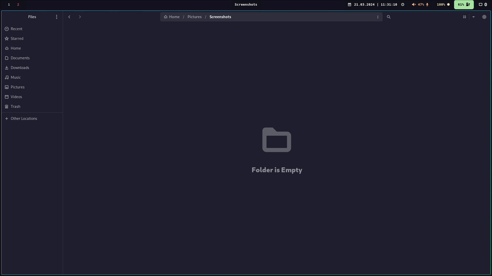
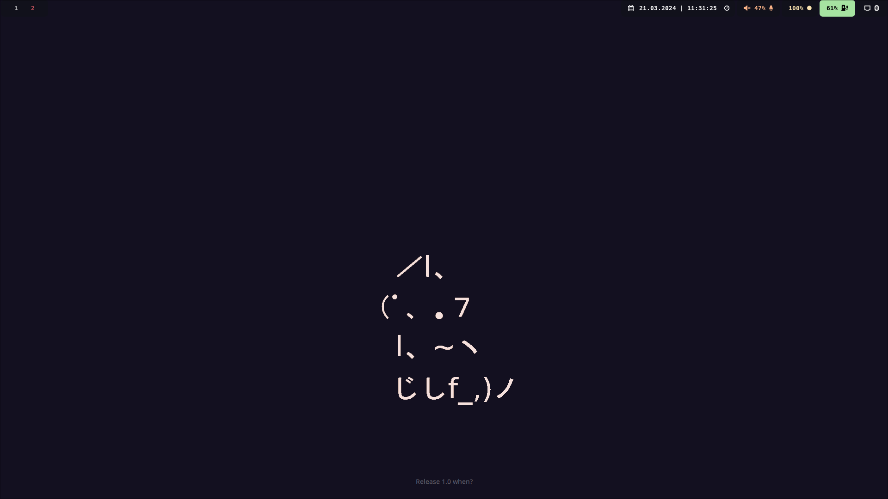
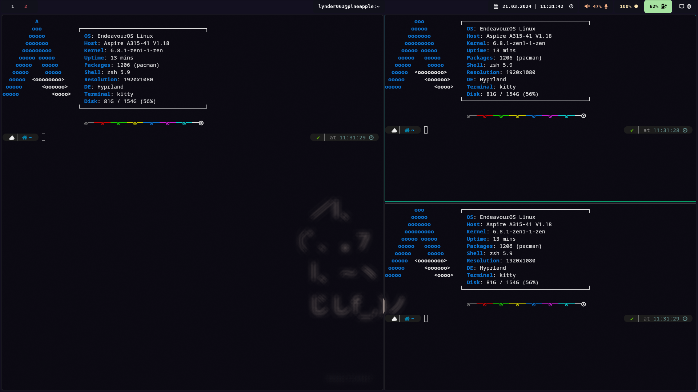
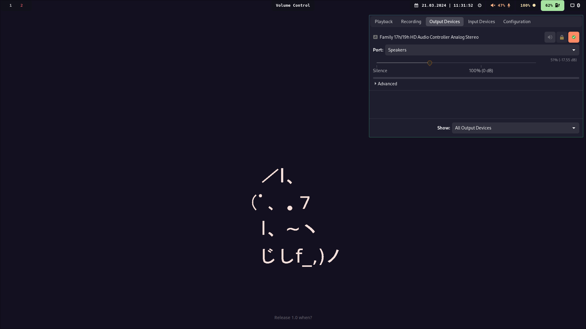

# My Arch Linux rice






## TODO
- [ ] Add icons to `install.sh` file
- [x] Add keymap to `README.md`
- [ ] Rework keymap to `README.md`
- [ ] Fix swaylock or move to hyprland alternative
- [ ] Update rice screenshots

## Installation

### Automatic
I have created script for setuping this rice
```bash
./install.sh
```

### Manual install
#### Basic settings

- Adding user to correct groups

```bash
sudo usermod -aG input ${USER}
```

```bash
sudo usermod -aG video ${USER}
```

- Delete the existing `.config`

``` bash
rm -r .config
```

- Clone repository as `.config`
``` bash
cd $HOME &
git clone https://github.com/Lynder063/dotfiles.git .config
```

- Installation of basic packages

``` bash
yay -S hyprland kitty grim slupr wofi waybar neovim ttf-hack-nerd ttf-font-awesome noto-fonts-emoji network-manager-applet blueman-applet dunst hyprpaper swaylock-effects catppuccin-gtk-theme-mocha-gnome hyprshot polk - keyring ly nwg-look neofetch nautilus ocs-url wget curl xdg-desktop-portal-hyprland tela-icon-theme
```

- Set a dark theme for the **gnome** applications

``` bash
gsettings set org.gnome.desktop.interface color scheme prefer-dark
```
#### Zsh

``` bash
yay -S zsh zsh-autosuggestions zsh-syntax-highlighting zsh-theme-powerlevel10k
```

- Let's run `zsh` and type **0**

- We will install [ohmyzsh](https://ohmyz.sh/#install)

> [!WARNING]
> You need to have the `curl` and `wget` packages installed


``` bash
sh -c "$(curl -fsSL https://raw.githubusercontent.com/ohmyzsh/ohmyzsh/master/tools/install.sh)"
```

- And we this in `.zshrc` file
``` bash
source /usr/share/zsh/plugins/zsh-syntax-highlighting/zsh-syntax-highlighting.zsh
source /usr/share/zsh/plugins/zsh-autosuggestions/zsh-autosuggestions.zsh
source /usr/share/zsh-theme-powerlevel10k/powerlevel10k.zsh-theme
ZSH_AUTOSUGGEST_STRATEGY=( complete history )
[ "$TERM" = "xterm-kitty" ] && alias ssh="kitty +kitty ssh"
neofetch
```

#### Nautilus
 
``` bash
nautilus -q
```

- We will install the terminal addon in nautilus

``` bash
yay -S nautilus-open-any-terminal
```

- Add support for kitty terminal

``` bash
gsettings set com.github.stunkymonkey.nautilus-open-any-terminal terminal kitty
```

#### Grub
[Thanks shvchk <3](https://github.com/shvchk/fallout-grub-theme?tab=readme-ov-file)

- Download the installation script

``` bash
wget -P /tmp https://github.com/shvchk/fallout-grub-theme/raw/master/install.sh
```

- Let's launch
``` bash
bash /tmp/install.sh
```

#### Ly

- We start the daemon for ly
``` bash
sudo systemctl enable ly --now
```

## Keymap
- `$mainMod + RETURN`: Execute `kitty`
- `$mainMod + SHIFT + Q`: Kill active window
- `$mainMod + SHIFT + E`: Exit
- `$mainMod + E`: Execute `nautilus`
- `$mainMod + F`: Fullscreen
- `$mainMod + E`: Execute `thunar`
- `Mod4 + SHIFT + S`: Execute `screenshot.sh` (script for screenshot, needs to be in `/usr/local/bin/`)
- `$mainMod + V`: Toggle floating
- `$mainMod + D`: Execute `wofi`
- `Mod4 + L`: Execute `swaylock`
- `$mainMod + P`: Pseudo
- `$mainMod + J`: Toggle split
- `$mainMod + arrow keys`: Move focus (left, right, up, down)
- `$mainMod + [0-9]`: Switch workspaces (1-10, modified for Czech keyboard layout)
- `$mainMod + SHIFT + [0-9]`: Move active window to workspace (1-10, modified for Czech keyboard layout)
- `$mainMod + scroll`: Scroll through existing workspaces
- `$mainMod + LMB/RMB` (dragging): Move/resize windows
- `$mainMod + CTRL + arrow keys`: Resize active window (left, right, up, down)
- `$mainMod + SHIFT + RETURN`: Swap master with slave window

