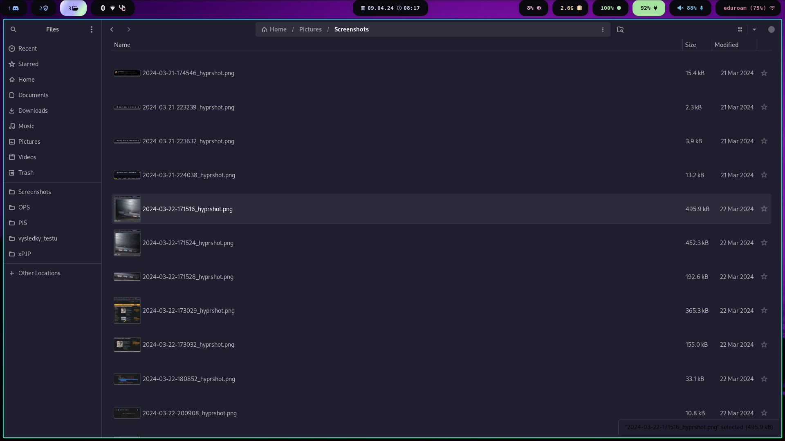

# My Arch Linux setup
i use arch btw

- Compositor: **Hyprland** 
- Terminal: **Kitty** 
- Shell: **zsh** 
- Icons : **Tela icons Purple**
- Color scheme: **Cattpuccin Mocha** 
- GUI file manager: **Nautilus** 
- Bar: **Waybar** 
- App launcher: **Wofi** 
- Text editor: **Neovim** 
- PDF viewer: **Zathura** 





## 📝 TODO
- [ ] Add kvantum into script and README.md
- [x] Redo WOFI protože Jakub je debil @jktech 
- [ ] Redo README.md to by more redeable
- [x] Reconfigure WOFI theming 
- [x] Fix `install.sh` file
- [x] Fix swaylock or move to hyprland alternative
- [x] Update rice screenshots
- [x] Correct waybar colors
- [x] [Hyprland autotag naming](https://github.com/hyprland-community/hyprland-autoname-workspaces)

## Credit

Thank you [shvchk](https://github.com/shvchk) for awesome GRUB theme and [JKech](https://gitlab.com/jktech) for help with debugging ❤️


## Installation

#### 📄 Automatic
I have created script for setuping this rice
```bash
./install.sh
```
Test on `archlinux-2024.03.01` with kernel `6.8.2`

### Manual install
#### 📖 Basic settings

- Adding user to correct groups

```bash
sudo usermod -aG input ${USER}
```

```bash
sudo usermod -aG video ${USER}
```

- Delete the existing `.config`

``` bash
rm -r .config
```

- Clone repository as `.config`
``` bash
cd $HOME &
git clone https://github.com/Lynder063/dotfiles.git .config
```

- Copying scripts for wofi to `/usr/local/bin`

```bash
cp $HOME/.config/wofi/emoji.sh $HOME/.config/hypr/gamemode.sh $HOME/.config/wofi/screenshot.sh /usr/local/bin
```

- 📦 Installation of basic packages

``` bash
yay -S hyprland kitty grim slupr wofi waybar neovim ttf-hack-nerd ttf-font-awesome noto-fonts-emoji network-manager-applet blueman-applet dunst hyprpaper catppuccin-gtk-theme-mocha-gnome hyprshot polkit gnome-keyring ly nwg-look neofetch nautilus ocs-url wget curl xdg-desktop-portal-hyprland tela-icon-theme-purple-git hyprland-autoname-workspaces-git hyprlock hypridle wtype wl-clipboard
```

- Set a dark theme for the **gnome** applications

``` bash
gsettings set org.gnome.desktop.interface color scheme prefer-dark
```
#### 🖥️ Zsh

``` bash
yay -S zsh zsh-autosuggestions zsh-syntax-highlighting zsh-theme-powerlevel10k
```

- Let's run `zsh` and type **0**

- We will install [ohmyzsh](https://ohmyz.sh/#install)

> [!WARNING]
> You need to have the `curl` and `wget` packages installed


``` bash
sh -c "$(curl -fsSL https://raw.githubusercontent.com/ohmyzsh/ohmyzsh/master/tools/install.sh)"
```

- And we this in `.zshrc` file
``` bash
source /usr/share/zsh/plugins/zsh-syntax-highlighting/zsh-syntax-highlighting.zsh
source /usr/share/zsh/plugins/zsh-autosuggestions/zsh-autosuggestions.zsh
source /usr/share/zsh-theme-powerlevel10k/powerlevel10k.zsh-theme
ZSH_AUTOSUGGEST_STRATEGY=( complete history )
[ "$TERM" = "xterm-kitty" ] && alias ssh="kitty +kitty ssh"
neofetch
```

#### 📂 Nautilus
 
``` bash
nautilus -q
```

- We will install the terminal addon in nautilus

``` bash
yay -S nautilus-open-any-terminal
```

- Add support for kitty terminal

``` bash
gsettings set com.github.stunkymonkey.nautilus-open-any-terminal terminal kitty
```

- Enable settings to show hidden files


```bash
gsettings set org.gnome.nautilus.preferences show-hidden-files true
```

#### 🔐 Grub

- Download the installation script

``` bash
wget -P /tmp https://github.com/shvchk/fallout-grub-theme/raw/master/install.sh
```

- Let's launch
``` bash
bash /tmp/install.sh
```

#### 🏁 Ly

- We start the daemon for ly
``` bash
sudo systemctl enable ly --now
```

